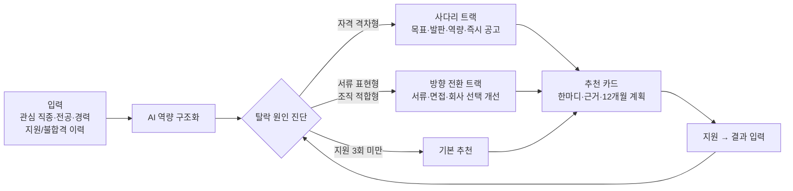

# 1차 기획안 초안 (v0.1)

> 공모전 제시 목차 기준 · 자유양식 · 10쪽 이내 · 이미지 포함 필수
> `[그림 n]` 표시는 PDF 제작 시 이미지로 삽입할 위치

---

## 아이디어명

**커리어 사다리: 탈락 원인을 진단하는 AI 신입 커리어 경로 추천**

> 목표 직종만 검색하다 반복 탈락하는 신입에게, 탈락 원인을 먼저 진단하고
> 목표 직장까지 가는 단계별 실제 공고와 판단 근거·이후 계획을 함께 제시합니다.

`[그림 1] 서비스 컨셉 — "진단 → 두 갈래 추천 → 설득과 계획" 한 장 요약`

---

## 1. 아이디어 정의 및 대상

### 1-1. 아이디어 내용

커리어 사다리는 신입 구직자가 입력한 **관심 직종·전공·경력·지원 및 불합격 이력**을 분석해 다음 세 가지를 제공합니다.

| 핵심 기능 | 내용 |
|---|---|
| ① 탈락 원인 진단 | 지원 공고의 요건 충족도와 탈락 단계(서류/면접) 패턴으로 **자격 격차형 / 서류 표현형 / 조직 적합형**을 구분 |
| ② 두 갈래 공고 추천 | **사다리 트랙**(자격 격차형): 목표 공고 · 경력 발판 · 역량 키우기 · 즉시 적합 단계로 나눈 실제 고용24 공고 추천 **방향 전환 트랙**(서류 표현형·조직 적합형): 눈을 낮추지 않고 서류 표현, 면접, 성향에 맞는 회사 선택 방향 제시 |
| ③ 설득형 추천 카드 | 모든 추천에 **공감의 한마디 + 부드러운 판단 근거 + 지원 이후 12개월 계획** 제시, 지원 결과를 입력하면 재진단 |

### 1-2. 대상과 이용 상황

- **주 대상**: 경력이 없는 신입 구직자(청년), 목표 직종 신입 채용이 적어 반복 탈락 중인 구직자
- **이용 상황**

| 구분 | 페르소나 A — 자격 격차형 | 페르소나 B — 조직 적합형 |
|---|---|---|
| 상황 | 기계공학 졸업, 목표 기계설계. 경력 없이 설계직만 지원해 서류 5회 탈락 | 요건은 모두 충족. 서류는 4번 통과했지만 면접에서 4번 탈락 |
| 기존 방식 | "설계" 공고만 계속 검색·지원 | 같은 유형의 회사에 같은 방식으로 반복 지원 |
| 커리어 사다리 | 진단: 경력 요건이 장벽 → 도면·공정 역량을 쌓을 수 있는 품질관리 공고 추천 + 1년 후 설계직 재도전 계획 | 진단: 회사 인재상(도전·빠른 실행)과 성향(신중·꼼꼼)의 차이 가능성 → 정확성·품질을 중시하는 같은 직무 회사 추천 + 면접 보완 |

### 1-3. 고용24 기존 서비스에 없거나 개선이 필요한 이유

1. **신입에게도 경력을 요구하는 채용 시장**
   - 대졸 신규 입사자의 28.9%가 이미 업무 경력을 보유한 '중고 신입'[^1]
   - 기업의 81.6%가 신규채용 시 가장 중요한 평가 요소로 '직무 관련 업무 경험'을 꼽음[^2]
   - 인사담당자가 꼽은 2026년 HR 최대 이슈: '중고 신입 선호 강화'(33.5%)[^3]
2. **기존 서비스는 '맞는 직업'과 '훈련'까지만 안내**
   - 잡케어: 관심사 기반 연관 직업 추천, 역량 비교 로드맵, 훈련·자격증 추천
   - 취업확률 기반 구직컨설팅(2026.6): 희망 직종 취업확률과 훈련·자격증·서류 보완점 제시
   - → **"경력이 없어 목표 직종에 못 들어가는" 신입에게 경력을 쌓을 실제 공고를 단계별로 제시하는 기능은 없음**
3. **불합격 이력이 활용되지 않음**
   - 기업은 탈락 사유를 알려주지 않고, 기존 서비스도 지원 결과를 반영하지 않음
   - 자격 부족인지, 표현·적합성 문제인지 모른 채 같은 방식의 지원이 반복됨
4. **설명 없는 추천은 받아들여지지 않음**
   - 목표보다 낮아 보이는 공고를 이유 없이 추천하면 "눈을 낮추라"는 말로 받아들여져 거부감이 생김

> TODO: 고용행정통계로 목표 직종별 구인배수·신입(경력무관) 공고 비중 수치 추가

---

## 2. AI·데이터 활용 계획

### 2-1. 적용 AI 기술과 적용 논리

| 기능 | 적용 AI 기술 | 적용 논리 |
|---|---|---|
| 경력 구조화 | 생성형 AI(LLM) 구조화 추출 | "공장 알바 6개월, CAD 수업 프로젝트" 같은 자유 서술 → 역량 키워드·수준(JSON) |
| 공고 분석 | LLM 구조화 추출 | 채용상세의 직무내용·우대조건 → 요구 역량, 인재상·조직문화 키워드 |
| 역량 매핑 | 텍스트 임베딩 유사도 | 공고·경력의 역량 표현을 직업정보 업무수행능력·지식 항목에 정규화(동의어·맥락 처리) |
| 탈락 패턴 해석 | LLM 추론 + 규칙 진단 | 여러 탈락 공고의 공통 장벽(경력 요건, 인재상 패턴) 추출 → 규칙 엔진이 유형 판정 |
| 추천 카드 생성 | LLM 개인화 생성 | 진단 결과·점수·공고 정보를 슬롯으로 받아 한마디·근거·12개월 계획 문장 생성 |

### 2-2. AI가 반드시 필요한 이유

1. **입력이 비정형 텍스트**: 경력 서술, 공고 직무내용, 인재상은 정해진 형식이 없어 규칙만으로는 역량을 뽑아낼 수 없음
2. **역량 표현의 다양성**: 같은 역량도 "도면 해독", "설계도 검토", "CAD 도면 확인"처럼 다르게 쓰여 의미 기반 매칭이 필요
3. **사람마다 다른 설득과 계획**: 탈락 이력·성향·목표·추천 공고의 조합은 사람마다 달라, 고정 템플릿으로는 납득 가능한 설명을 만들 수 없음

### 2-3. AI와 규칙의 역할 분담 (신뢰 확보)

`[그림 2] 판단은 데이터로, 설명은 AI로 — 역할 분담도`

| 규칙·데이터로 계산 | 생성형 AI가 담당 |
|---|---|
| 현재 적합도(F), 목표 기여도(T), 경력 인정 가능성(C), 지금 지원 1순위(S) 점수 | 경력·공고 텍스트의 역량 구조화 |
| 탈락 원인 진단 분기, 사다리 단계 분류 | 탈락 패턴 해석 문장 |
| 구인배수·마감일·역량 충족도 등 모든 수치 | 한마디·판단 근거·계획 문장 개인화 |

- **환각 방지**: 수치는 계산값을 문장 틀에 끼워 넣고, AI는 수치를 새로 만들지 않음
- **말투 원칙**: "눈을 낮추세요", "하향 지원" 등 금지 표현 필터, 성향은 '결함'이 아닌 '회사와의 궁합'으로 설명
- **가설 제시**: 탈락 원인은 추정임을 밝히고 사용자에게 확인 질문
- **개인정보**: 지원 이력·성향 정보는 기본 비저장, 저장 시 동의

### 2-4. 활용 데이터 및 확보 방안

| 데이터 | 출처 | 용도 |
|---|---|---|
| 채용정보(목록·상세) | 고용24 Open API | 추천 공고 수집, 현재 적합도, 인재상 추출 |
| 직업정보 | 고용24 Open API | 목표 직업 필요 역량 → 목표 기여도·경력 인정 가능성 |
| 학과정보 | 고용24 Open API | 전공 → 관련 직업·보유 역량 추정 |
| 국민내일배움카드 훈련과정 | 고용24 Open API | 부족 역량 보완 과정 매칭 |
| 구인구직취업현황 | 고용행정통계(EIS) | 직종별 구인배수 → 채용 수요·경쟁도 |
| 입사지원 이력, 프로필·성향 | 모의데이터 | 탈락 원인 진단 시연(실제 개인정보 미포함) |

- **생성형 AI**: 선정 20팀에 제공되는 생성형 AI 플랫폼 활용
- **확보 방안**: 공공데이터포털·고용24 Open API 인증키 발급 후 호출, 직업정보(약 500개 직업)·훈련과정은 사전 수집·캐시, 공고는 실시간 조회(호출 한도 대응)
- 비공개 정보(입사지원 이력, 직업심리검사 결과)는 모의데이터로 대체, 확장 시 본인 동의 하에 연동
- 상세 항목은 **붙임 1. 데이터 활용명세서** 참고

---

## 3. 실행계획

### 3-1. 개발 기간 내 구현 가능한 MVP 범위 (2주 · 1인 · AI 코딩 도구 활용)

| 구분 | 기능 | 활용 데이터 |
|---|---|---|
| **P0** 반드시 시연 | 온보딩 · AI 경력 인터뷰(대화로 경력 입력 → 역량 태그) | 학과정보, 직업정보 + 생성형 AI |
| | 탈락 원인 진단(자격 격차형 · 서류 표현형 · 조직 적합형) | 채용상세, 모의 지원 이력 |
| | 사다리 추천과 지금 지원 1순위(F·T·C·S) | 채용정보, 직업정보, 고용행정통계 |
| | 설득형 추천 카드(한마디 · 판단 근거 · 역량 충족도 · 12개월 계획) | 계산값 + 생성형 AI |
| **P1** 구현 목표 | 전 직종 실시간 공고 조회(직업정보 약 500개 직업 사전 캐시) | 채용정보, 직업정보 |
| | 공고 번호만 넣으면 지원 이력·요건 자동 채움 | 채용상세(구인인증번호 조회) |
| | 공고·기업 상세(기업 정보, 직종·지역 구인배수 차트) | 채용상세, 고용행정통계 |
| | 서류 코칭(서류 표현형) | 채용상세 + 생성형 AI |
| | AI 모의면접(조직 적합형, 회사 인재상 기반) | 채용상세 인재상 + 생성형 AI |
| | 훈련과정 추천(부족 역량별, 취업률·만족도순) | 국민내일배움카드 훈련과정 |
| | 마이페이지(지원 현황 보드 · 결과 입력 · 재진단 기록 · 알림), 커리어 경로 타임라인 | 모의데이터, 계산값 |
| **P2** 여유 시 | 공고 지도 보기, 목표 직종 2~3개 비교 | 채용정보(근무지 주소), 직업정보 |
| | 상담사 대시보드(반복 탈락자 목록 · 진단 요약 · 상담 요청) | 모의데이터 |

- 일정: 1~2일 데이터 연동·캐시 → 3~7일 P0 → 8~11일 P1 → 12일 P2 → 13~14일 검증·시연 자료
- 시연: 페르소나 3명(자격 격차형·서류 표현형·조직 적합형)으로 진단 세 유형과 두 트랙 모두 시연
- 확장 계획(해커톤 이후): 고용24 입사지원 이력·직업심리검사 결과 연동, 실제 상담 연계, 잡케어·취업확률 구직컨설팅 결과 연동, 민간 공고 확장
- 모의로만 가능한 것: 입사지원 이력 자동 연동(비공개 → 직접 입력·공고 번호 입력), 직업심리검사(→ 자가진단), 상담 연결(→ 상담 요청 화면)

### 3-2. 서비스 흐름

`[그림 3] 서비스 흐름도`

### 3-3. 주요 화면 구성 — 구직자 11종 + 상담사 1종

`[그림 4] 화면 구성도` `[그림 5~9] 화면 목업(경력 인터뷰, 진단·추천 결과, 추천 카드 상세, AI 모의면접, 상담사 대시보드)`

| 흐름 | 화면 | 우선순위 |
|---|---|---|
| 시작 | S1 온보딩·AI 경력 인터뷰 / S2 지원 이력 추가(공고 번호 입력) | P0 / P1 |
| 진단 | S3 진단 결과 | P0 |
| 추천 | S4 추천 결과(지금 지원 1순위 + 사다리 뷰, P2 지도·목표 비교) / S5 추천 카드 상세 / S6 공고·기업 상세 | P0 / P0 / P1 |
| 준비·실행 | S7 서류 코칭 / S8 AI 모의면접 / S9 훈련과정 추천 | P1 |
| 관리 | S10 마이페이지 / S11 커리어 경로 / S12 상담사 대시보드 | P1 / P1 / P2 |

**추천 카드 예시 (페르소나 A, 수치는 예시)**

> **A. 한마디** — 다섯 번의 도전 끝에 찾은 우회로예요. 돌아가는 길 같지만, 설계직에 가장 빨리 닿는 길일 수 있어요.
>
> **B. 왜 이렇게 판단했나요?**
> 1. 지원하신 5곳 중 4곳이 '관련 경력 1년 이상'을 우대했어요. 실력보다 경력 항목이 비어 있던 게 가장 큰 차이였던 것 같아요.
> 2. 기계설계에 필요한 역량 중 지금 갖춘 건 약 45%예요. 특히 도면 해독·공정 이해 경험이 비어 있어요.
> 3. 이 공고는 매일 도면을 보고 공정을 점검하는 일이라, 1년이면 약 70%까지 오를 것으로 예상돼요.
>
> **C. 이후 계획** — 지원 전: CAD 프로젝트를 '도면 작성 경험'으로 기재 → 1~3개월: 도면·검사 기준 익히기, 업무 기록 → 4~6개월: 3D CAD 훈련 병행 → 7~12개월: 역량 재점검 후 설계 보조 공고 도전 → 12개월 이후: 목표 공고 재도전

### 3-4. 팀 구성 및 역할 분담

| 구성 | 역할 |
|---|---|
| 개인(1인) | 서비스 기획, 데이터 분석·API 연동, 진단·추천 로직 개발, AI 프롬프트 설계, 화면 개발, 시연 |

- 1인 개발에 맞춰 MVP 범위를 핵심 기능 중심으로 한정하고, 선정 20팀에 제공되는 생성형 AI 플랫폼과 AI 코딩 도구를 활용해 개발 속도 확보

---

## 4. 독창성·차별성

### 4-1. 현행 고용24 및 민간 서비스 대비 차별성

| 구분 | 고용24 잡케어 | 고용24 취업확률 구직컨설팅 | 민간(사람인 AI 코칭 등) | **커리어 사다리** |
|---|---|---|---|---|
| 핵심 질문 | 나에게 맞는 직업은? | 희망 직종 취업 확률은? | 이 공고에 맞게 서류를 고치려면? | **목표에 닿으려면 지금 어디에 지원해야 하나?** |
| 추천 단위 | 직업 + 유사 공고 | 훈련·자격증·일자리 | 공고·서류 첨삭 | **단계별 실제 공고(목표·발판·역량·즉시)** |
| 부족 역량 해결 | 훈련·자격증 | 훈련·자격증·서류 보완 | 서류 보완 | **일자리로 채우기 + 훈련 보조** |
| 불합격 이력 | 미반영 | 미반영 | 미반영 | **탈락 원인 진단 → 처방 분기** |
| 설명 방식 | 결과 제시 | 확률·보완점 | 첨삭 | **한마디·근거·12개월 계획** |

### 4-2. 아이디어의 참신성

1. **"부족한 역량을 훈련이 아니라 일자리로 채운다"** — 경력을 쌓을 발판 공고를 목표와 연결해 제시
2. **불합격을 데이터로 활용** — 같은 탈락도 원인에 따라 처방이 다름(자격 격차면 사다리, 적합성이면 방향 전환)
3. **눈을 낮추라고 하지 않는 추천** — 판단 근거와 이후 계획을 함께 보여줘 추천을 납득하고 실행하게 함

---

## 5. 기대효과

### 5-1. As-Is / To-Be 국민 체감 효과

| 구분 | As-Is | To-Be |
|---|---|---|
| 공고 탐색 | 목표 직종 이름으로만 검색 | 목표로 이어지는 발판·역량 공고까지 단계별 확인 |
| 탈락 대응 | 원인을 모른 채 같은 방식으로 반복 지원 | 탈락 패턴 진단 → 원인별 처방 |
| 추천 수용 | 이유 없는 추천에 거부감 | 한마디·근거·계획으로 납득 |
| 입사 이후 | 목표까지의 경력 관리 단절 | 12개월 계획과 재진단으로 목표 재도전 |
| 상담 접근 | 센터를 찾아가야 개인 맞춤 상담 | 언제든 셀프 진단, 필요 시 상담 연결 |

- **성과 지표(안)**: 추천 공고 지원 전환율, 지원 대비 서류 통과율 변화, 추천 수용도(👍 비율), 재방문율, 12개월 내 목표 직종 도달률

### 5-2. 고용서비스 정책 목표와의 부합성

1. **국가 고용서비스 혁신방안(2026.8)**: 고용24를 '나만의 AI 고용센터'로 개편하고 구직자를 자기주도형·집중지원형으로 나누는 방향과 일치. 자기주도형 구직자의 셀프 서비스를 맡고, 반복 탈락자는 상담으로 연결해 상담 인력이 집중지원형에 집중하도록 지원
2. **고용24 AI 서비스와의 연계**: 잡케어·취업확률 기반 구직컨설팅 결과 화면에 '커리어 사다리' 탭으로 연동해 "맞는 직업 → 지금 지원할 공고"까지 이어지는 흐름 완성
3. **청년 고용 지원**: '중고 신입' 선호로 커지는 신입의 진입 장벽을 공공 서비스가 직접 완화
4. **국민내일배움카드 활용 확대**: 부족 역량에 맞춘 훈련과정 연결로 훈련과 취업의 연계 강화

---

## 붙임 1. 데이터 활용명세서

[data_spec.md](data_spec.md)의 명세표를 그대로 삽입

---

[^1]: 매일신문, "'즉시 전력 인원 선호' 10명 중 3명이 경력 있는 중고 신입"(2025.3.2) https://www.imaeil.com/page/view/2025030215034771955
[^2]: KDI 경제교육·정보센터, "2025년 신규채용 실태조사 결과" https://eiec.kdi.re.kr/policy/domesticView.do?ac=0000193378
[^3]: 이투데이, "2026년 HR 시장 키워드는 '중고 신입'" https://www.etoday.co.kr/news/view/2542173

## 제출 전 확인할 것

1. 각주 수치 원문 재확인(조사 기관·시점)
2. 고용행정통계 근거 수치 추가(1-3)
3. 데이터 활용명세서 ★ 항목 API 명세서로 확인
4. `[그림 1~6]` 이미지 제작 후 PDF 변환, 10쪽 이내 확인
